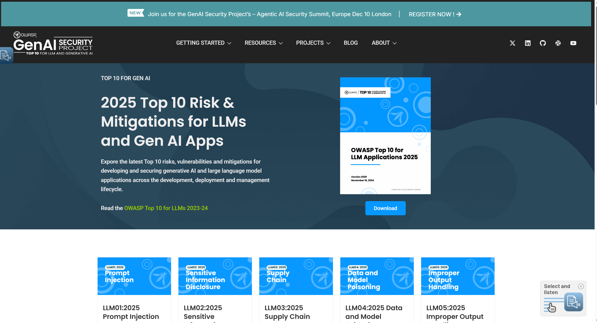
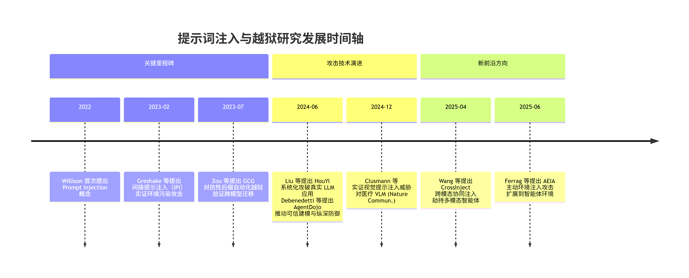
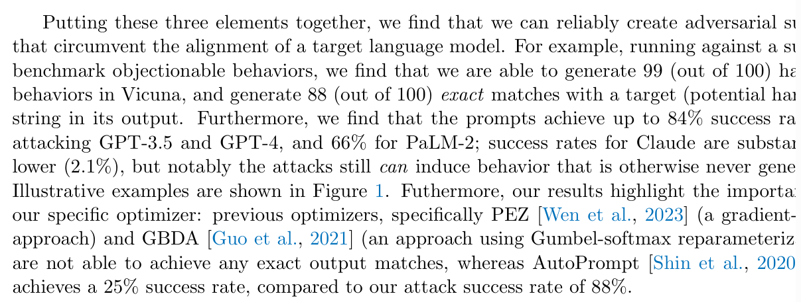
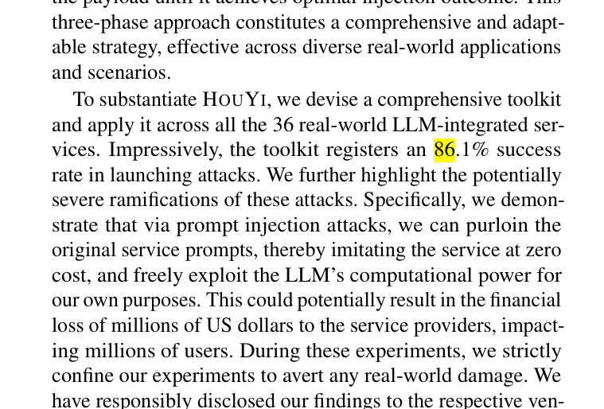

# 提示词注入 (Prompt Injection) 草稿

## 概念、界定与核心目标
"提示词注入 (Prompt Injection, PI)","一种通过恶意构造的输入（提示词）来劫持或覆盖 LLM 预设的系统指令（System Prompt）的攻击方法 [Willison, 2022]。攻击者试图改变模型的行为，使其执行未经授权的任务。",更改 LLM 的任务目标或行为逻辑。

越狱 (Jailbreaking),"PI 的一个子集，特指通过输入指令来诱骗 LLM 绕过其安全护栏 (Safety Guardrails) 或内容过滤器，使其生成有害、被禁或受限内容的攻击方法 [Xu et al., 2023]。",迫使 LLM 违反其安全政策或生成有害内容。

通用对抗性攻击 (Universal Adversarial Attack),"一种通过在输入提示词中添加通用且可迁移的对抗性后缀 (Adversarial Suffix) 来绕过模型安全机制的方法 [Zou et al., 2023]。该后缀可以在多个 LLM 上保持有效，无需针对特定模型进行训练。",实现跨模型、高效的自动化越狱。

## 研究价值
提示词攻击的研究价值在于：

- 基础架构漏洞： 攻击揭示了当前 LLM 架构的一个根本性缺陷：模型难以区分开发者提供的系统指令（System Prompt，被视为“信任”输入）和用户提供的指令（User Prompt，被视为“非信任”输入）。
- 供应链风险： 随着 LLM 被集成到更多复杂应用（如 Copilot, Agent 系统）中，成功的提示词攻击可能导致数据泄露、权限提升、外部系统控制等严重后果 [Perez et al., 2023]。

在 OWASP 组织的网站上，提示词注入攻击被列为 LLM 十大安全风险之首，充分证明了其重要性。

## 发展时间轴

## 代表性工作与发展历程

2023 年发表的《Universal and Transferable Adversarial Attacks on Aligned Language Models》一文首次系统性地提出了一种名为 **GCG**（Gradient-based Constrained Generation）的自动化越狱攻击方法，标志着提示词攻击从手工试探迈向了可规模化、可迁移的自动化阶段。该方法的核心思想是，在一个明确的有害请求（例如“写一封钓鱼邮件”）之后，自动生成一段看似无意义的**对抗性后缀**（Adversarial Suffix），以此来“欺骗”模型的内部表示机制。GCG通过一种**基于梯度引导的贪心搜索算法**，在离散的 token 空间中高效地优化这个后缀，目标是最小化模型生成预设有害内容的损失函数。其惊人之处在于强大的**跨模型迁移能力**：研究者仅在开源模型（如 LLaMA、Vicuna）上优化生成的对抗性后缀，便能以高达 **66% 的成功率**（针对 GPT）在完全黑盒、未曾见过的顶尖闭源商业大模型（包括 Google 的 Palm-2 和 Anthropic 的 Claude）上实现越狱。这一发现不仅颠覆了业界对对齐模型安全性的认知，证明了其安全护栏存在系统性、可被利用的脆弱点，而且为后续的攻防研究提供了一个强大且标准化的攻击基准，深刻揭示了当前大模型安全对齐机制的根本性挑战。

[https://arxiv.org/pdf/2307.15043.pdf](https://arxiv.org/pdf/2307.15043.pdf?spm=a2ty_o01.29997173.0.0.5b285171TDFjRN&file=2307.15043.pdf)

2024 年发表于顶级安全会议 IEEE S&P 的论文《Prompt Injection Attack against LLM-integrated Applications》提出了一种名为 HouYi 的新型黑盒提示注入攻击框架，标志着提示词攻击的研究重心从“越狱模型”正式转向了“攻破真实世界的 LLM 集成应用”。该研究首先通过一项针对 10 个商业应用的探索性研究，揭示了传统攻击方法（如直接注入、转义字符、上下文忽略）在复杂应用面前的普遍失效，并深刻指出其根源在于这些应用将用户输入视为待分析的“数据”而非待执行的“指令”。受传统 Web 漏洞（如 SQL 注入）的启发，HouYi 创新性地提出了一个三段式攻击载荷结构：一个与应用正常流程无缝融合的框架组件（Framework Component），一个能有效触发上下文分割的分隔符组件（Separator Component），以及一个承载攻击者真实意图的破坏者组件（Disruptor Component）。通过自动化地推断目标应用上下文、生成并动态优化这三部分载荷，HouYi 在对 36 个真实 LLM 应用的大规模评估中取得了 86.1%（31/36）的惊人成功率，成功实现了系统提示窃取（Prompt Leaking）和计算资源滥用（Prompt Abuse）等高危攻击，并获得了包括 Notion 在内的 10 家厂商的漏洞确认。这项工作不仅暴露了当前 LLM 应用生态中普遍存在的、可被规模化利用的严重安全风险，更提供了一套系统化、自动化且极具实战价值的攻击方法论，为后续的防御研究树立了新的、更贴近现实的基准。

https://arxiv.org/pdf/2306.05499

## 参考文献（BibTeX）
@misc{owasp2025llmtop10,
  title={OWASP Top 10 for Large Language Model Applications},
  author={OWASP Foundation},
  year={2025},
  howpublished={\url{https://genai.owasp.org/resource/owasp-top-10-for-llm-applications-2025/}}
}

@article{zou2023universal,
  title={Universal and transferable adversarial attacks on aligned language models},
  author={Zou, Andy and Schuster, Zifan and Jia, J. Zico and Song, Jie and Ranganath, Ashwin and Ge, Qi and Chen, Matt and Kusunose, Takahiro and Poursaeed, Omid and Leung, Kwan Yee and others},
  journal={arXiv preprint arXiv:2307.15043},
  year={2023},
  url={https://arxiv.org/abs/2307.15043},
  doi={10.48550/arXiv.2307.15043}
}

@misc{liu2023prompt,
  title={Prompt Injection attack against LLM-integrated Applications},
  author={Yi Liu and Gelei Deng and Yuekang Li and Kailong Wang and Tianwei Zhang and Yepang Liu and Haoyu Wang and Yan Zheng and Yang Liu},
  year={2023},
  eprint={2306.05499},
  archivePrefix={arXiv},
  primaryClass={cs.CR}
}