# 实验报告（结构化说明）


static std::atomic`<int>` g_HNSW_M{41};

static std::atomic`<int>` g_HNSW_MAX_LAYER{4};

static std::atomic`<int>` g_HNSW_EF_CONSTRUCTION{967};

static std::atomic `<int>` g_HNSW_EF_SEARCH{433};


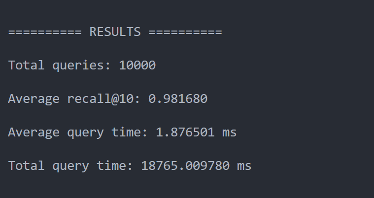

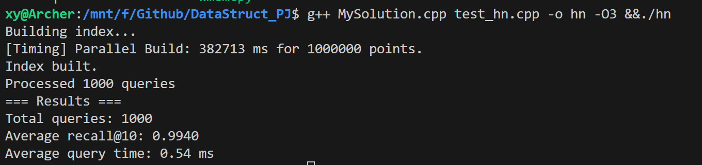

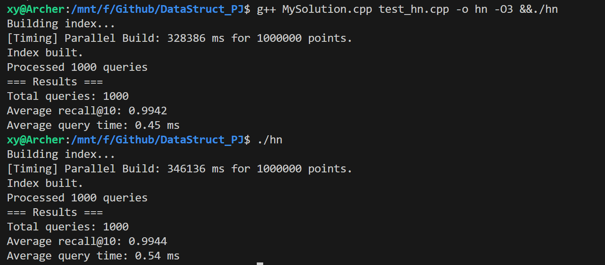

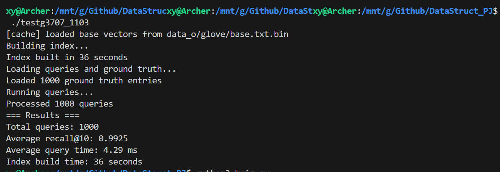

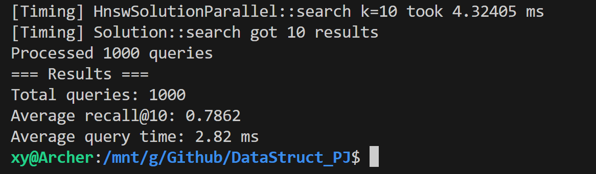

 Current: C=4137, P=800 -> Recall=0.9860, Time=4.60ms, Reward=181.159420
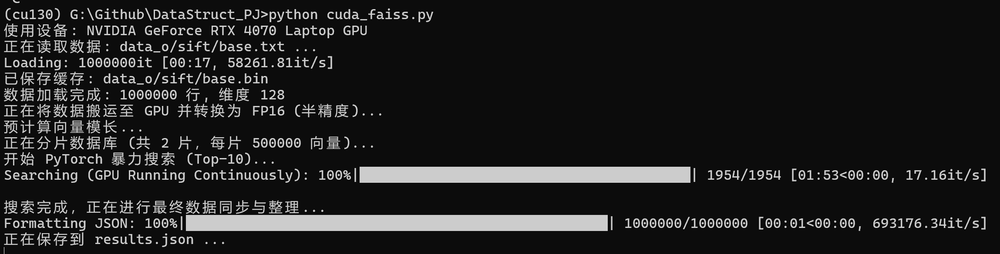

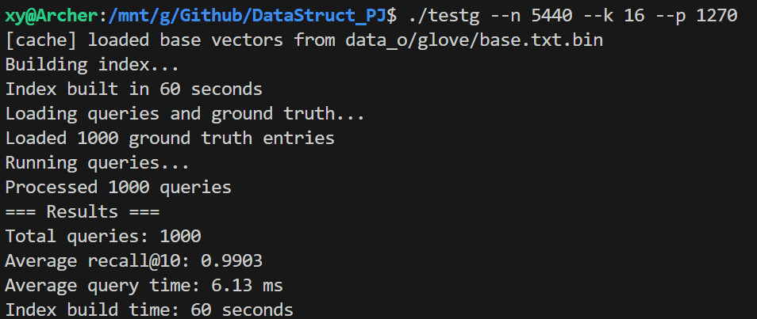

这是glove上 SEARCH_THREAD=4的实验

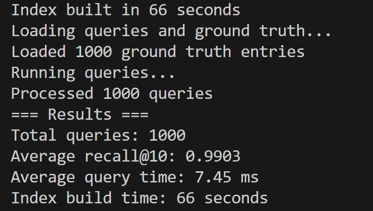

12

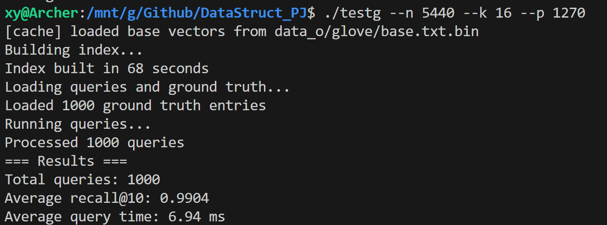

16

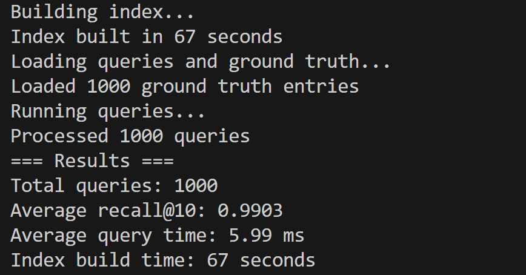

8

Current: C=5022, P=1064 -> Recall=.988900, Time=3.690000ms, Reward=249.083373

尝试了HNSW,非常劣

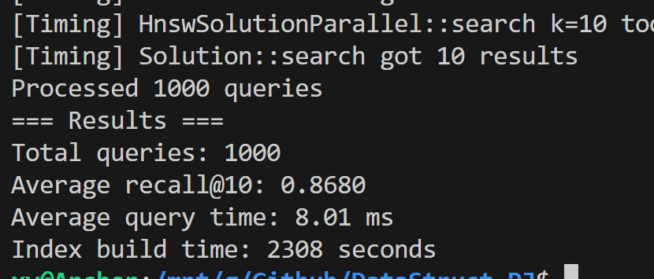

## 1. 代码主要文件

- MySolution.cpp / MySolution.h: 主索引实现（类 solution 与包装类 Solution）
- hnswlib/*: 可选近似图索引（当前未集成调用，仅保留空间定义）

## 2. 核心类与职责

- class solution: 完整索引状态与算法实现
  - build/build_from_memory/finalize_build: 构建流程入口与收尾
  - search: 查询入口（Top-K）
- class Solution: 外部接口包装，保持一个全局实例 g_impl

## 3. 重要成员（solution）

- dim: 向量维度
- point_ids_: 原始点 id（顺序映射）
- point_data_: 连续存储的所有点 float 数组，长度 N*dim
- centroid_data_: 质心数组，长度 C*dim
- inverted_index: vector<vector `<BucketItem>`>，按质心分桶
  - BucketItem { int index; float dist_to_centroid; }
- kd_nodes_ + kd_root_: 质心 KD 树
- num_centroid / kmean_iter / nprob: 构建与查询参数
- num_threads: 并行度
- 关键内联访问：point_ptr(i), centroid_ptr(c)

## 4. 数据结构内存布局

- 点数据：SoA 扁平 float[N*dim]，行连续，便于 SIMD
- 质心：同样扁平 float[C*dim]
- 倒排桶：每桶 vector `<BucketItem>`，总元素数 = N
- KD 树节点：顺序存储，axis + centroid_index + left/right + split_value

## 5. 构建流程函数链

1. build / build_from_memory: 加载或接收内存数据，填充 point_data_
2. finalize_build:
   - 初始化质心（随机采样）
   - 重复 kmean_iter 次：
     - kmeans_assign_parallel: O(N*C*dim) 线性 + 多线程
     - kmeans_update_parallel: 聚合归并
   - 构建 KD 树：build_kdtree
   - 构建倒排：再次线性分配每点到最近质心并记录距离（可复用最后一次 assignment——目前未做）
   - 结束后可查询

## 6. 查询流程 (search)

1. find_closest_centroids_simd:
   - KD 树 + 最大堆选 nprobe 个最近质心
   - 回退线性扫描（若无树）
2. 每个质心桶并行遍历：
   - 下界剪枝：fabs(dist(q,c) - dist(p,c)) >= worst → 跳过
   - compute_distance_simd: SIMD L2（AVX 8 元批次，尾部标量）
   - 局部最大堆维护 k
3. 合并所有线程候选，partial_sort 取前 k

## 7. 关键优化点

- 连续内存 + AVX 距离计算 (compute_distance_simd)
- 线程分块（assignment/update/桶扫描）
- 预取 _mm_prefetch 下一向量
- 下界剪枝减少精确距离次数
- KD 树减少质心全扫描（nprobe << C）

## 8. 复杂度（主项）

- K-Means assignment: O(T * N * C * dim)
- K-Means update: O(T * (N*dim + C*dim))
- 倒排构建（当前实现二次最近质心计算）: O(N * C * dim)（可降为 O(N*dim)）
- 质心检索（KD 树）: 平均近似 O(log C + nprobe log C)，最坏 O(C)
- 查询桶扫描: 约 O( (N * nprobe / C) * dim )（均匀簇假设）
- 内存: 4*N*dim + 4*C*dim + 8*N + O(C)

## 8. 复杂度（主项）补充推导

### 8.1 K-Means assignment (kmeans_assign_parallel)

核心循环：
for i in [0,N):                // 外层 N
  for c in [0,C):              // 质心枚举 C
    for d in [0,dim):          // 距离累加维度 dim
      acc += (x[i,d]-centroid[c,d])^2

总标量操作 ~ N * C * dim * (2 加减 + 1 乘)。SIMD (AVX 8-wide) 有效减少常数，但不改变 O(N*C*dim)。
迭代 T 轮 → O(T * N * C * dim)。

### 8.2 K-Means update (kmeans_update_parallel)

遍历所有点一次，将其向量逐维加到对应簇累加器：
for i in [0,N):
  dst = sums[c_i]
  for d in [0,dim): dst[d] += x[i,d]

时间 O(N*dim)。归并线程 + 均值化每簇：O(C*dim)。整体每轮 O(N*dim + C*dim)，T 轮仍受 assignment 主导。

### 8.3 倒排构建 (finalize_build 中第二次最近质心归属)

当前实现再次线性最近质心扫描（与 assignment 同结构）：
for i in [0,N):
  find_closest_centroid_linear(point_ptr(i)) // 内部遍历所有 C
→ O(N*C*dim)。可优化：在最后一次 kmeans_assign_parallel 保留 assignments 与点到质心距离（一次距离重算即可），降为 O(N*dim)。

### 8.4 KD 树构建 (build_kdtree)

递归层数 ~ log C，每层对区间执行 nth_element 线性，子问题规模加总：
T(C) = C + 2 * T(C/2) → O(C log C)（比较操作，不含维度遍历；仅按某 axis 取单 float）。

### 8.5 查询：质心选择 (find_closest_centroids_simd)

KD 递归访问节点；理想均衡树：
访问 ~ O(log C + nprobe * log C)。最坏退化（非均衡或全部回溯） O(C)。

### 8.6 查询：桶扫描 (search)

选中 nprobe 个质心，设簇均匀：每桶期望大小 ≈ N / C。
扫描点数 S ≈ nprobe * (N / C)。
对每点：

- 下界计算 1 次 fabs → O(1)
- 若通过剪枝：SIMD 距离 O(dim/8) load+算术
  设剪枝后保留比例 ρ ∈ (0,1]，有效精确距离次数 ≈ ρ * S。
  总时间 ≈ O(S + ρ * S * dim/8) = O( (N * nprobe / C) * (1 + ρ * dim) )。

候选合并：
partial_sort 取前 k 在 M=ρ*S 范围内：O(k log k + M)（M>>k 时主项仍由扫描决定）。

### 8.7 总查询复杂度

O( log C + nprobe log C + (N * nprobe / C) * (1 + ρ * dim) )。
常见参数：nprobe << C，ρ 低于 0.5 时剪枝有效。

## 9. 内存估算补充来源

- point_data_: N*dim floats → 4Ndim bytes
- centroid_data_: C*dim floats → 4Cdim bytes
- inverted_index: N BucketItem → 每项 {int(4) + float(4)} = 8N bytes
- kd_nodes_: C 节点 → {axis(4) + centroid_index(4) + left(4) + right(4) + split_value(4)} = 20C bytes
- assignments（构建临时）: N ints → 4N bytes
  合并：4Ndim + 4Cdim + 8N + 20C (+ 4N 临时)。忽略 vector 容器元数据。

## 10. 剪枝正确性来源

利用三角不等式：
|d(q,c) - d(p,c)| ≤ d(q,p)
若当前最大堆最差距离 = D_max 且 |d(q,c) - d(p,c)| ≥ D_max → d(q,p) ≥ D_max → 不可能进入堆 → 跳过精算。

代码对应：
search() 中:
float lower = fabs(cq - bucket[j].dist_to_centroid);
if (size>=k && lower >= local.top().first) continue;

## 11. 可行优化点（与代码映射）

- 去重倒排构建：在 kmeans_assign_parallel 最后一轮保存 assignments + 计算点到其质心距离 → 删除 finalize_build 中再次 find_closest_centroid_linear 调用。
- 质心检索替换：find_closest_centroids_simd → HNSW 版本（减少 O(C) 线性常数）。
- 向量重排：按簇分块重写 point_data_ 提升缓存命中（影响桶扫描阶段）。
- SIMD 扩展：detect AVX512 → 分支到 compute_distance_simd512 实现，减少 i 循环步数。
- 距离缓存：查询批处理时预先缓存与选中质心的距离 cq，避免重复 compute_distance_simd (当前已缓存 centroid_dists，但批量可共享)。

## 12. 参数影响公式汇总

- 查询扫描主项 ≈ N * nprobe / C
  → 增 C：扫描降低，assignment 与倒排（构建）上升。
  → 增 nprobe：扫描线性上升，召回提高。
- 维度 dim：乘在所有距离计算项上；SIMD 把系数从 dim 降到 dim/8（AVX）。
- ρ（剪枝保留率）：经验可通过统计“执行精确距离次数 / 扫描点数”获得。

## 13. 现有重复计算标记

finalize_build():
  thread_results 生成后再 inverted_index 重建时使用 find_closest_centroid_linear 重算距离。
优化：在 kmeans_assign_parallel 最后一次迭代中同时记录 (point -> centroid, dist)。可将 thread_results 逻辑改为直接消费该记录。

## 14. 最小修改入口（扩展）

- 在 finalize_build 尾部插入外部近似索引构建（HNSW）
- 在 search 开头替换质心检索调用

## 15. 代码逻辑引用解析

### 15.1 构建入口与主链路

```cpp
void solution::build_from_memory(int d, std::vector<std::vector<double>> data) {
    // 写入 point_data_
    for (size_t i = 0; i < n; ++i) {
        float* dst = point_ptr(i);
        for (int j = 0; j < dim; ++j) dst[j] = (float)data[i][j];
    }
    finalize_build();
}
```

说明：数据装载 O(N*dim)，随后进入 finalize_build。

```cpp
void solution::finalize_build() {
    // 初始化随机质心
    for (int i = 0; i < num_centroid; ++i)
        memcpy(centroid_ptr(i), point_ptr(dist(rng)), sizeof(float)*dim);

    // K-Means 迭代
    for (int iter = 0; iter < kmean_iter; ++iter) {
        kmeans_assign_parallel(assignments);
        kmeans_update_parallel(assignments, new_centroids);
        centroid_data_.swap(new_centroids);
    }

    // 构建 KD 树
    kd_root_ = build_kdtree(ids, 0, num_centroid, 0);

    // 构建倒排：再次最近质心 + 记录距质心距离
    // 线程分块生成 thread_results -> 汇总到 inverted_index
}
```

说明：核心阶段顺序清晰：初始化 → T 次迭代 → KD 树 → 倒排。重复最近质心计算是可优化点。

### 15.2 K-Means 赋值阶段 (复杂度来源)

```cpp
void solution::kmeans_assign_parallel(std::vector<int>& assignments) {
    auto worker = [this,&assignments](int start,int end){
        for (int i = start; i < end; ++i) {
            assignments[i] = find_closest_centroid_linear(point_ptr(i));
        }
    };
}
int solution::find_closest_centroid_linear(const float* vec) const {
    float best = INF;
    for (int c = 0; c < num_centroid; ++c) {   // 循环 C
        float dist = compute_distance_simd(vec, centroid_ptr(c)); // 距离维度循环
        if (dist < best) { best = dist; best_idx = c; }
    }
    return best_idx;
}
```

说明：外层 N（point），中层 C（centroid），内层 compute_distance_simd 遍历 dim（或 dim/8 SIMD 步）。复杂度来源：O(N*C*dim)。

### 15.3 K-Means 更新阶段

```cpp
void solution::kmeans_update_parallel(...){
    // 每线程局部累加
    for (int i = start; i < end; ++i) {
        int c = assignments[i];
        float* dst = sums.data() + c*dim;
        const float* src = point_ptr(i);
        for (int d = 0; d < dim; ++d) dst[d] += src[d];
    }
    // 汇总 + 均值
    for (int c = 0; c < num_centroid; ++c) {
        for (int t = 0; t < threads; ++t)
            for (int d = 0; d < dim; ++d) dst[d] += src[d];
        // 除以 count
    }
}
```

说明：加和 O(N*dim)，汇总 O(C*dim)。每轮 O(N*dim + C*dim)，T 轮仍受 assignment 主导。

### 15.4 KD 树构建

```cpp
int solution::build_kdtree(std::vector<int>& indices,int begin,int end,int depth){
    int axis = depth % dim;
    int mid = (begin + end) / 2;
    std::nth_element(indices.begin()+begin, indices.begin()+mid, indices.begin()+end,
        [this,axis](int a,int b){ return centroid_ptr(a)[axis] < centroid_ptr(b)[axis]; });
    // 递归左右
}
```

说明：每层对区间执行 nth_element（线性），递归深度 ~ log C，总体 O(C log C)。

### 15.5 倒排构建（当前实现的重复计算）

```cpp
auto worker = [this,&thread_results](int start,int end,int tid){
    for (int i = start; i < end; ++i) {
        const float* vec = point_ptr(i);
        int c = find_closest_centroid_linear(vec);  // 再次最近质心
        float dist = compute_distance_simd(vec, centroid_ptr(c));
        thread_results[tid][c].push_back({i, dist});
    }
};
```

说明：与 assignment 同结构，再次 O(N*C*dim)。优化：复用最后一轮 assignments + 单次点到质心距离 O(N*dim)。

### 15.6 SIMD 距离核心

```cpp
float solution::compute_distance_simd(const float* a,const float* b) const {
    for (; i <= dim - 8; i += 8) {
        __m256 va = _mm256_loadu_ps(a+i);
        __m256 vb = _mm256_loadu_ps(b+i);
        __m256 diff = _mm256_sub_ps(va, vb);
        sumv = _mm256_add_ps(sumv, _mm256_mul_ps(diff,diff));
    }
    // 剩余尾部标量
}
```

说明：主循环步长 8，实际执行次数 ≈ dim/8，常数下降，不改大 O 级别。

### 15.7 查询阶段：质心选择

```cpp
auto close_centroids = find_closest_centroids_simd(query, std::min(nprob,num_centroid));
void solution::search_kdtree(...){
    // 递归：访问节点 → 堆更新 → 基于超球体距离回溯
}
```

说明：均衡时访问 O(log C + nprobe log C)，最坏 O(C)。

### 15.8 查询阶段：桶扫描与剪枝

```cpp
for (size_t j = 0; j < bucket.size(); ++j) {
    float lower = fabs(cq - bucket[j].dist_to_centroid); // 下界
    if (local.size() >= k && lower >= local.top().first) continue; // 剪枝
    float exact = compute_distance_simd(query.data(), point_ptr(bucket[j].index));
    // 更新局部堆
}
```

说明：扫描点数 S ≈ nprobe * N / C（均匀假设）。保留比例 ρ：精确距离调用 ~ ρS → O(ρ * S * dim/8)。

### 15.9 查询候选合并

```cpp
// 聚合线程局部
all_candidates.insert(...);
// 局部数目 M = Σ局部
if (M > k) partial_sort(...k...);
```

说明：合并与选择 O(M + k log k)，M 受前面桶扫描决定，一般 M >> k 时主项仍在扫描。

### 15.10 查询总复杂度推导

- 质心阶段：O(log C + nprobe log C)
- 桶扫描：S = nprobe * N / C，精确距离：ρ S * dim/8
- 总：O(log C + nprobe log C + (N * nprobe / C) * (1 + ρ * dim))

### 15.11 剪枝正确性（来自三角不等式）

```cpp
lower = |d(q,c) - d(p,c)| ≤ d(q,p)
if lower ≥ D_max (堆最差距离) ⇒ d(q,p) ≥ D_max ⇒ 不可能进入堆 ⇒ 跳过
```

### 15.12 优化落点与对应代码位置

| 优化点           | 代码引用                                    | 动作                             |
| ---------------- | ------------------------------------------- | -------------------------------- |
| 去掉重复最近质心 | finalize_build worker                       | 使用最后一次 assignments         |
| 替换 KD 树       | find_closest_centroids_simd / search_kdtree | 引入 HNSW                        |
| 聚类后重排点数据 | inverted_index 构建后                       | 重新写回 point_data_ 按桶顺序    |
| AVX512 扩展      | compute_distance_simd                       | 条件检测分支                     |
| 缓存点到质心距离 | thread_results 生成处                       | 保留 dist + assignments 快速查询 |
